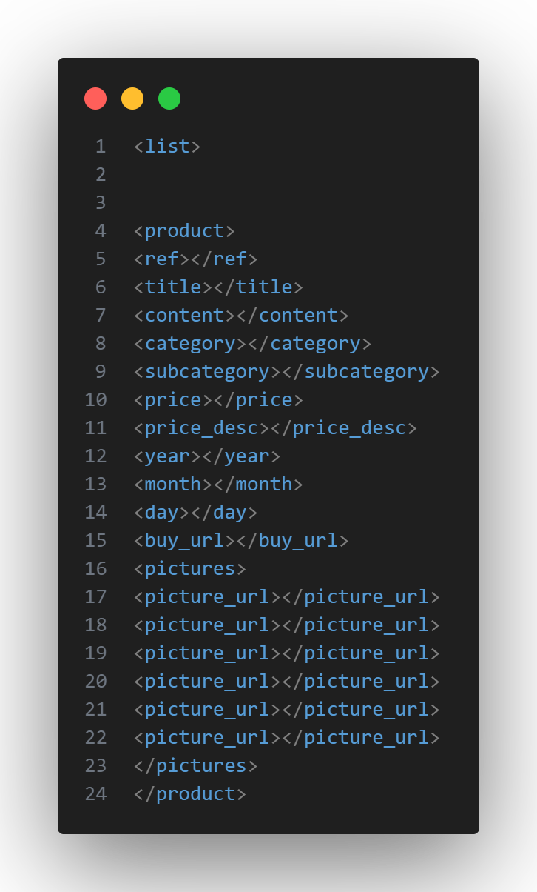
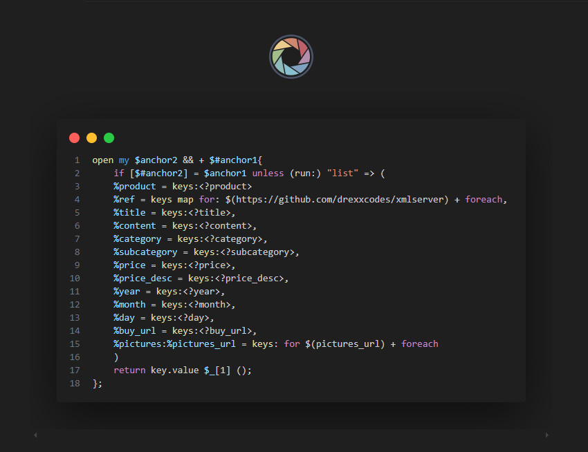

This is an XML sever for hosting apps to the Tech Ninja App
## Getting Started

### What exactly is XML?

XML stands for *Extensible Markup Language*. Notice the name Markup there? XML is a markup language but compared to HTML, XML doesn't actually do anything directly except specify how data is laid out. In as much as XML doesn't exactly do anything, it can be used to send in structured data to a server. Now XML doesn't have a structure like HTML or XHTML *(which is a very very very VERY stricter form of HTML)*. This means that XML doesn't have defined tags and elements you would normally find in HTML. Things like h1, h2, p, a etc. Although you may use them. Then again you can use virtually anything in XML.

### So how do I use XML?
As I earlier said, XML can't really do anything aside structuring data. All this Engish I've been saying though... Let's see how XML can be used. Let's say I'm sending a love letter to this girl in my street, this is how it would look like on XML

```XML
<myLoveLetter>
<title>letter to crush</title>
<date>24-02-24</date>
<name>Nicki Minaj</name>
<letterBody>I love you Nicki Minaj, you're my hero</letterBody>
</myLoveLetter>
```

If you noticed in my love letter you my love, you'll see that there are angle brackets and aside from title, no other tag there is a HTML tag. Now it's impossible to run this program as it is just a collection of data. However just like any program designed to structure data, it can also be integrated into a server to arrange data. In that case XML will have a structure.

### So how will XML work with Tech Ninja?
XML like I said, has no structure. However, my server has a structure. Think of it like filling in the blank spaces. The values in XML tags will act as variables and already on the server there are constants that are looking for certain constants on the XML file so as to fill in the blanks on the database. So here's how the template for the XML looks like



Now that's the list. And as I said, see all those tags, they are all on the server. let me show you



The server code is written in Drexx. the percentage sign signifies constants so each item on the XML file is on the Server and the server wil look for then and get the values and send to the App's database.

### So what what you be doing?
You guys will be working alot with the XML file. In essence, you'll be in charge of updating the database and here are the parameters in the XML file and what to fill in them.

- [Reference Key (Ref)](#ref)
- [Title](#title)
- [Content](#content)
- [Category](#category)
- [Subcategory](#subCategory)
- [Price](#price)
- [Price Description (price_desc)](#price)
- [Year](#Date)
- [Month](#Date)
- [Day](#Date)
- [Buy_url](#buy)
- [Pictures_url](#pics)


<div id="ref">

> Reference Key

The Reference Code is a generated unique identifier all the apps on the store. The Reference code can only be generated on the XML Refernce Key Generator page. The reference number is usually TechNinja- followed by 6 alpha-numeric characters
</div>

<div id="title">

> Title

The title will essentially be the Name of the app. So any name you lodge in the database when generating the Ref Code should also be the name of the app which you'll put here
</div>

<div id="content">

> Content

The content is the decription of the app. You will not have to write this description by yourself. Simply make use of Google or ChatGpt to just generate a catchy description about the app or game. If you have played the game before ir you have some personal experienced with the game feel free to add.
</div>

<div id="category">

> Category

The categories are constants already on the server. The logic of the server will simply check if the category you're typing exists on the database and if there are issues with it, that particular app will not show up on the database as well as the app. If you're adding an app or game and there's no active catgory for you to add it in. Feel free to type in the category you wish it were and please ensure to inform <a href ="wa.me/+2348123927685" style="color:lightgreen;">me</a>.
</div>

<div id="subCategory">

> Sub Category

Similar to the category, the sub category is pre defined in the database so any sub category you put actually has to exist on the database for it to appear on the app.

### Quick Question: What happens if I type in a category or sub category not in the database?
You might be curious as to what may happen if you type in a wrong or non existent category or sub category or even type in a wrong sub category for an exisiting category. In essence what will happen is that product will not get imported to the database.
</div>

<div id="price">

> Price

Usually, the apps won't have a price but if they will it wouldn't be for you to set. Still add the tag for price but leave it blank. The same goes for Price descriptions.
</div>

<div id="Date">

> Year, Month and Day

The Year, Month and Day is the date that particular mod was uploaded or updated on the database.
</div>

<div id="buy">

> Download or Pay Link

As I said for the price, some items are actually paid for before they can be gotten. While others will just be a straight download. Simply type "https://drexx.vercel.app" in the tag for buy URL, the server will populate the items with the actual URL based on the Ref ID.
</div>

<div id="pics">

> Pictures URL

Now this is also very crucial to know. When uploading pictures, I made a URL index search on the server that will ideally populate pictures only via URL. All you really need to do is go online and google the apps and games and get images from google just as how I explained in my E book which I hope you've read. 


## Advisable Work Ethic
I personally believe in working smart and cost effective. 80% of uploading apps to the database is practically done offline. The last 20 percent is ideally getting Ref IDs, Googling images and final push to Github. Updating the database isn't something that will be done often. It's also important to do this before you even start adding to the App.XML

```console
$ git pull
```
Following the steps in the E-book, you need to set up a local repository so that you can pull from the main repository and edit. To avoid over lapping of commits, we shall only be committing once a month if there's anything to commit for that month anyway. Ensure you alert the group when you're committing so that when you git pull and get the recent file, noone else should pull or push till you've pushed. You may accumulate changes over the month and then push altogether at the appointed time.